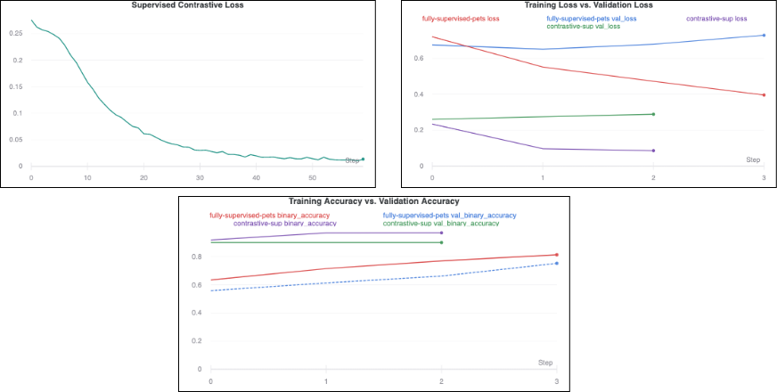
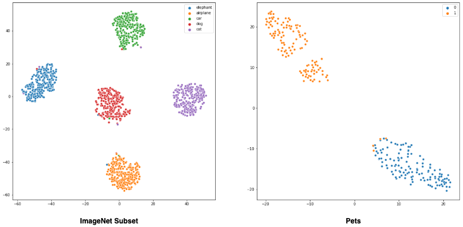

# Supervised-Contrastive-Learning-in-TensorFlow-2
Implements the ideas presented in [Supervised Contrastive Learning](https://arxiv.org/pdf/2004.11362v1.pdf) by Khosla et al. The authors propose a two-stage framework to enhance the performance of image classifiers and also achieves SoTA results.


(Figures gathered from the paper)

A detailed discussion of the paper and the results of our experiments are available here is [this report](link to be updated).

This repository consists of the notebooks (runnable on Colab) showing the experiments we have done.

## About the notebooks
```
├── Flowers
│   ├── Contrastive_Training_Flowers.ipynb
│   ├── Contrastive_Training_Flowers_Augmentation.ipynb
│   ├── Fully_Supervised_Training_Flowers.ipynb
│   └── Fully_Supervised_Training_Flowers_Augmentation.ipynb
├── ImageNet_Subset
│   ├── Contrastive_Training_Imagenet_subset_Adam.ipynb
│   ├── Contrastive_Training_Imagenet_subset_RMSprop.ipynb
│   ├── Contrastive_Training_Imagenet_subset_SGD.ipynb
│   ├── Fully_Supervised_Training_IMGNET_subset_Adam.ipynb
│   ├── Fully_Supervised_Training_IMGNET_subset_RMSprop.ipynb
│   └── Fully_Supervised_Training_IMGNET_subset_SGD.ipynb
├── Pets
│   ├── Contrastive_Training_Pets.ipynb
│   └── Fully_Supervised_Training_Pets.ipynb
├── Visualization_ImageNet_subset.ipynb
├── Visualization_Pets.ipynb
```

**Note**:
- `Contrastive_Training_*.ipynb` notebooks show the supervised contrastive framework proposed in the paper.
- `Fully_Supervised_Training_*.ipynb` notebooks show the typical fully supervised training with different datasets.
- `Visualization_ImageNet_*.ipynb` notebooks show the visualizations of the embeddings learned by the supervised contrastive learning framework.

## About the datasets
- Flowers
- Pets
- ImageNet Subset (https://github.com/thunderInfy/imagenet-5-categories)

## Things to note
- The authors used AutoAugment in the paper. However, we used simple augmnetation operations which worked for the datasets we tried. Note that, there's no augmentation for the Pets dataset as we got pretty good results on that one even without any data augmentation.
- LARS optimizer was used in the paper, however we used Adam. We have also shown the effect of different optimizers like SGD and RMSProp along with learning rate schedules.

## Results



The above plots are from the experiments conducted on the **Pets** dataset. More results from the other two datasets have been discussed in the above-mentioned report and can be found here: https://app.wandb.ai/authors/scl. 

## Visualization of the embeddings learned by supervised contrastive learning



## Feedback
Via GitHub issues
